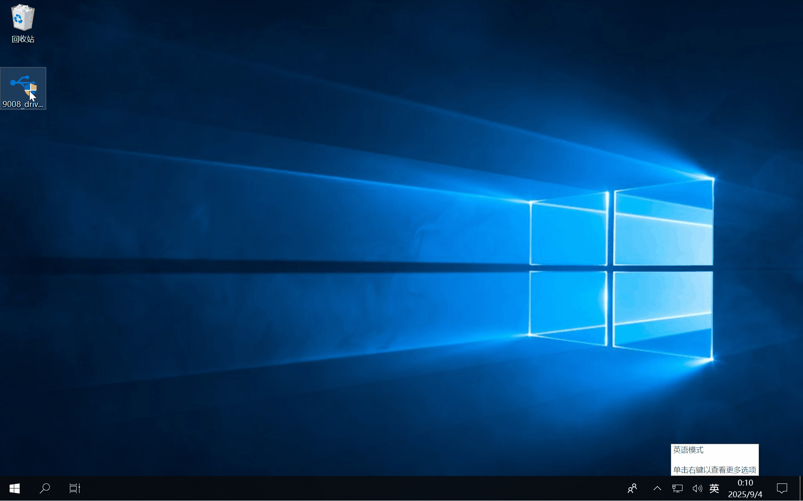

## 前言

去年（2024）我就在 B 站看到有人用 9.9 包邮的随身 WiFi 刷入 Debian / OpenWrt 系统玩，觉得很有趣就买了一个。不过，当时用了酷安的一键刷机包刷好 Debian 系统就放一边了。知道最近我正好需要一个 24 小时在线的 Linux 小机器运行一些脚本，就想起了这个随身 WiFi。

## 硬件配置

我买的随身 WiFi，内部主板型号是 **UFI003_MB_V02**，配置如下：

| 参数   | 说明                                   |
|--------|---------------------------------------|
| SoC    | 骁龙 410（MSM8916），四核 Cortex-A53 |
| 内存   | 512 MB                                |
| 存储   | 4 GB eMMC                             |

## 工具准备

刷入 Debian 系统前需要准备以下工具：

- 高通 9008 驱动（[点击下载](附件/9008_driver.7z)）
- ADB 工具（使用 [Scoop](https://scoop.sh/#/apps?q=adb) 安装）
- Debian 刷机包（[网盘链接](https://www.123pan.com/s/XwVDVv-WICn3)）

> [!NOTE]
> 这里用到的刷机包是从酷安大佬那边找到的，原谅我已经忘记原作者了，感谢大佬分享。

## 安装 9008 驱动

按照以下步骤安装 9008 驱动，自动安装的很简单：

